 72. ທ ສອນສັກດາ ຫານຊະນະ 3com2
 #### 🔌 Core Boards & Interfaces

 Core Boards & Interfaces 
 
1. Arduino Uno board

ການເຮັດວຽກຂອງ Arduino Uno** ✨

Arduino Uno ແມ່ນແຜງເອເລັກໂຕຣນິກທີ່ສາມາດຕັ້ງໂປຣແກຣມໄດ້ (Microcontroller Board) ເຊິ່ງຖືກອອກແບບມາເພື່ອໃຫ້ໃຊ້ງານງ່າຍ, ໂດຍສະເພາະສຳລັບຜູ້ເລີ່ມຕົ້ນ.

**ການເຮັດວຽກຂອງ Arduino Uno ແມ່ນຂຶ້ນກັບສ່ວນປະກອບຫຼັກຄື:
-ມັນປຽບເໝືອນ **ສະໝອງ** ຂອງແຜງວົງຈອນ.
    
-ໂປຣແກຣມ (ທີ່ເອີ້ນວ່າ **Sketch**) ທີ່ທ່ານຂຽນຈະຖືກເກັບໄວ້ ແລະ ຖືກປະມວນຜົນໂດຍຊິບໂຕນີ້.
    
-ມັນເປັນຜູ້ຮັບຜິດຊອບໃນການອ່ານ **Input** (ຂໍ້ມູນທີ່ປ້ອນເຂົ້າ) ແລະ ສົ່ງ **Output** (ຂໍ້ມູນທີ່ສົ່ງອອກ) ຕາມຄຳສັ່ງໃນໂປຣ    ແກຣມ.
  ** **Input/Output (I/O) Pins:**

- **Digital Pins (0-13):** ໃຊ້ສຳລັບການອ່ານ ຫຼື ສົ່ງຄ່າເປັນ **ສອງສະຖານະ** ເທົ່ານັ້ນ (ເຊັ່ນ: ON/OFF, HIGH/LOW ຫຼື 5V/0V).
    
- **Analog Input Pins (A0-A5):** ໃຊ້ສຳລັບການອ່ານຄ່າ **ຢ່າງຕໍ່ເນື່ອງ** ຈາກເຊັນເຊີຕ່າງໆ (ເຊັ່ນ: ອຸນຫະພູມ, ຄວາມສະຫວ່າງ) ແລະ ປ່ຽນຄ່າເຫຼົ່ານັ້ນໃຫ້ເປັນຄ່າ Digital ເພື່ອໃຫ້ Microcontroller ເຂົ້າໃຈໄດ້.
- ຮູບພາບອຸປະກອນຕົວຈິງ:

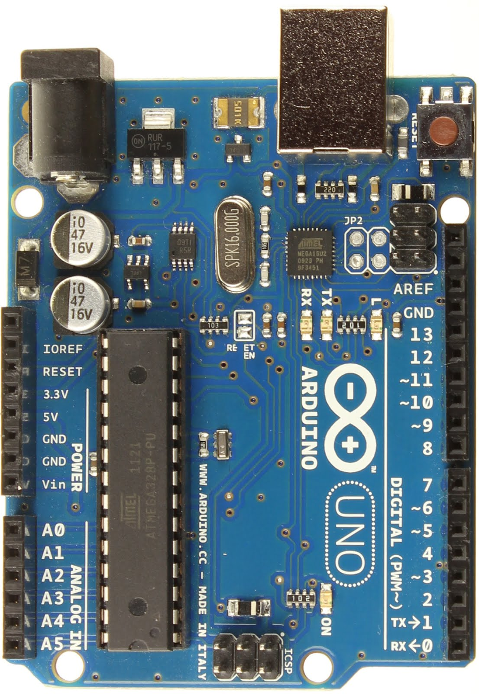

ຮູບອຸປະກອນແບບ Schematic Diagram :

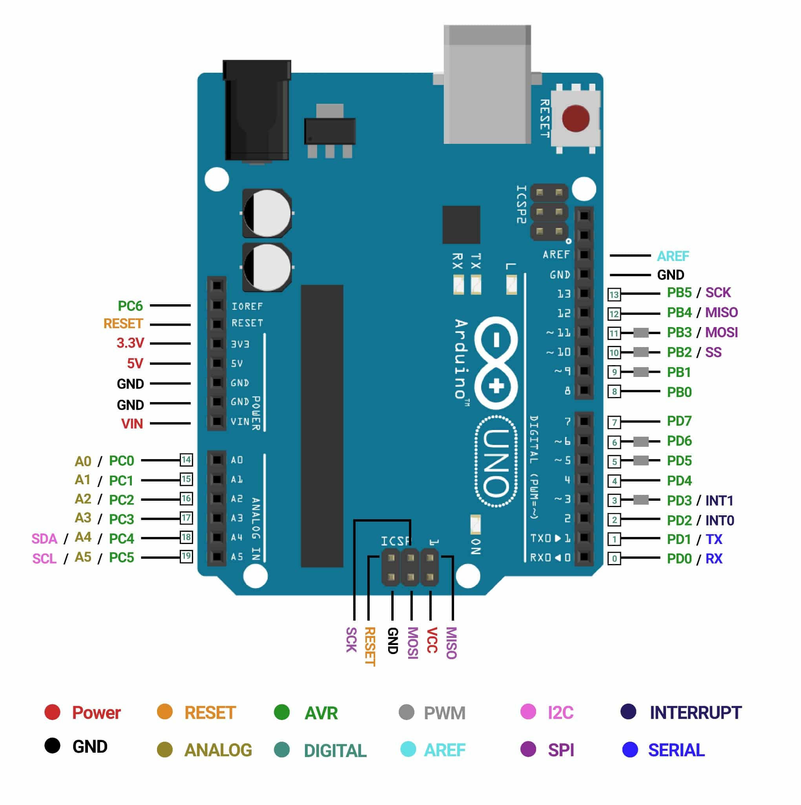

ຕົວຢ່າງ   ພື້ນຖານທີ່ສຸດຂອງການເຮັດວຽກຂອງ Arduino Uno ແມ່ນການເຮັດໃຫ້ໄຟ LED ກະພິບ. ຕົວຢ່າງນີ້ໄດ້ນຳໃຊ້ຂາອອກ(Output Pin) ດິຈິຕອລ ເພື່ອຄວບຄຸມການເປີດ/ປິດໄຟ.

2.Breadboards 

Breadboard ເຮັດວຽກໂດຍການເຊື່ອມຕໍ່ຈຸດຕ່າງໆພາຍໃນແຜງດ້ວຍ **ແຜ່ນໂລຫະທີ່ນຳໄຟຟ້າ** ທີ່ຢູ່ໃຕ້ຮູສຽບຕ່າງໆ.
- ຮູບພາບອຸປະກອນຕົວຈິງ:

ຮູບອຸປະກອນແບບ Schematic Diagram :

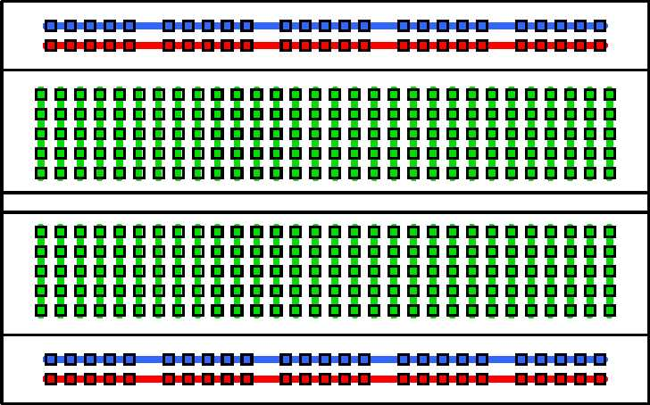 

3.USB cable 

ສາຍ USB (Universal Serial Bus) ແມ່ນສາຍເຄເບິນມາດຕະຖານທີ່ໃຊ້ສຳລັບການ **ເຊື່ອມຕໍ່**, **ສື່ສານຂໍ້ມູນ**, ແລະ **ສະໜອງພະລັງງານ** ໄຟຟ້າລະຫວ່າງອຸປະກອນຕ່າງໆ
- ຮູບພາບອຸປະກອນຕົວຈິງ:
  
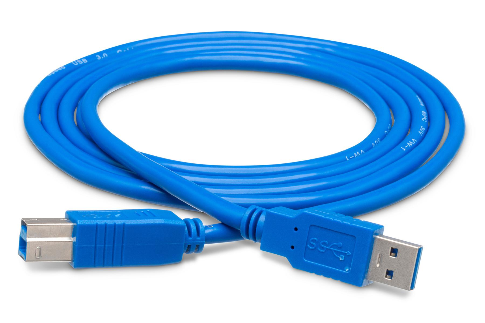

ຕົວຢ່າງ ເຊື່ອມຕໍ່ aduino ເຂົ້າຄອມພິວເຕ້ ເພື່ອຂຽນຄຳສັ່ງ

#### 🧵 Wiring & Connectors

 4.Jumper wires (male-to-male)
 
 ແມ່ນສາຍໄຟຟ້າທີ່ໃຊ້ໃນການເຊື່ອມຕໍ່ແບບຊົ່ວຄາວໃນວົງຈອນເອເລັກໂຕຣນິກ, ໂດຍສະເພາະແມ່ນການນຳໃຊ້ກັບ **Breadboard** ແລະແຜງຄວບຄຸມເຊັ່ນ **Arduino**.
 - ຮູບພາບອຸປະກອນຕົວຈິງ:
   
.jpg)

ຕົວຢ່າງ  Jumper Wires ຈະຖືກນຳໃຊ້ເພື່ອເຊື່ອມຕໍ່ສາຍໄຟຈາກ Arduino ໄປຫາ Breadboard, ແລະ ເພື່ອເຊື່ອມຕໍ່ອົງປະກອບຕ່າງໆ (ເຊັ່ນ: Resistor) ເຂົ້າກັບແຖວພະລັງງານຂອງ Breadboard.

5.Jumper wires (male-to-female)

ແມ່ນສາຍໄຟຟ້າທີ່ໃຊ້ໃນການເຊື່ອມຕໍ່ແບບຊົ່ວຄາວໃນວົງຈອນເອເລັກໂຕຣນິກ, ໂດຍສະເພາະແມ່ນການນຳໃຊ້ກັບ **Breadboard** ແລະແຜງຄວບຄຸມເຊັ່ນ **Arduino**.
 - ຮູບພາບອຸປະກອນຕົວຈິງ:

.jpg)

ຕົວຢ່າງ ການໃຊ້ສາຍ Female-to-Male ຄືການເຊື່ອມຕໍ່ **Servo Motor** ເຂົ້າກັບ Arduino:- Servo Motor ມີຂາຕໍ່ແບບ **Male Pin** (ຂາໂລຫະ) ຢູ່ສາມຂາ (Power, Ground, Signal).
    
- ທ່ານໃຊ້ປາຍ **Female** ຂອງ Jumper Wire ສຽບເຂົ້າໄປໃນຂາ Male ຂອງ Servo Motor ແຕ່ລະຂາ.
- ທ່ານໃຊ້ປາຍ **Male** ຂອງ Jumper Wire ທີ່ເຫຼືອສຽບເຂົ້າໄປໃນຮູສຽບຂອງ Arduino (ເຊັ່ນ: 5V, GND, ແລະ Digital Pin) ເພື່ອໃຫ້ວົງຈອນຄົບຖ້ວນ.

  
6. Jumper wires (female-to-female)
  
- ສາຍ **Jumper Wires (Female-to-Female)** ແມ່ນສາຍໄຟຟ້າທີ່ໃຊ້ໃນການເຊື່ອມຕໍ່ແບບຊົ່ວຄາວໃນວົງຈອນເອເລັກໂຕຣນິກ, ໂດຍສະເພາະແມ່ນເພື່ອ **ເຊື່ອມຕໍ່ລະຫວ່າງສອງຂາ Pin ໂລຫະ (Male Pins)**.
-  ຮູບພາບອຸປະກອນຕົວຈິງ:
    
- .jpg)

ຕົວຢ່າງ  ການນຳໃຊ້ **Female-to-Female Jumper Wires** ເພື່ອເຊື່ອມຕໍ່ລະຫວ່າງແຜງຄວບຄຸມ Arduino ແລະ ໂມດູນເຊັນເຊີທີ່ມັກຈະມີ **ຂາຕໍ່ແບບ Male Pin** ຢູ່ທັງສອງຝ່າຍ

7.9V Battery Connector

ສາຍເຊື່ອມຕໍ່ແບັດເຕີຣີ 9V (ເອີ້ນອີກຊື່ໜຶ່ງວ່າ **9V Battery Snap** ຫຼື **9V Clip**) ແມ່ນອຸປະກອນທີ່ງ່າຍດາຍທີ່ຖືກອອກແບບມາເພື່ອ **ສະໜອງພະລັງງານ** ໄຟຟ້າຈາກແບັດເຕີຣີ 9V ໃຫ້ແກ່ວົງຈອນເອເລັກໂຕຣນິກ.
- ຮູບພາບອຸປະກອນຕົວຈິງ:
  

ຕົວຢ່າງ  ການໃຊ້ງານທົ່ວໄປທີ່ສຸດຂອງສາຍເຊື່ອມຕໍ່ແບັດເຕີຣີ 9V ແມ່ນການນຳໃຊ້ເພື່ອສະໜອງພະລັງງານໃຫ້ແກ່ແຜງ **Arduino Uno** ເມື່ອມັນບໍ່ໄດ້ເຊື່ອມຕໍ່ກັບຄອມພິວເຕີຜ່ານສາຍ USB.

#### 💡 Basic Components

 8 .   LEDs (Red: 5, Yellow: 5, Blue: 5, RGB: 1)
 
 LED ແມ່ນອຸປະກອນເອເລັກໂຕຣນິກແບບ Semi-Conductor (ເຄິ່ງຕົວນຳ) ທີ່ປ່ອຍແສງອອກມາເມື່ອກະແສໄຟຟ້າໄຫຼຜ່ານມັນ. ໄຟ LED ແຕ່ລະປະເພດທີ່ທ່ານກ່າວເຖິງເຮັດວຽກຕາມຫຼັກການດຽວກັນ ແຕ່ມີໂຄງສ້າງ ແລະ ການຄວບຄຸມແຕກຕ່າງ
 - ຮູບພາບອຸປະກອນຕົວຈິງ:

ຮູບອຸປະກອນແບບ Schematic Diagram :

ຕົວຢ່າງ ຄວບຄຸມໄຟ LED ສີດຽວ (ເຊັ່ນ: ສີແດງ) ໃຫ້ເປີດ ແລະ ປິດ.

9.RGB module

**RGB Module** (RGB = Red, Green, Blue) ແມ່ນອຸປະກອນທີ່ນໍາໃຊ້ **ໄຟ LED ສາມສີ** (ສີແດງ, ສີຂຽວ, ແລະ ສີຟ້າ) ລວມເຂົ້າກັນໃນ Chip ດຽວເພື່ອສ້າງແສງສີຕ່າງໆໄດ້ເກືອບທັງໝົດ.
- ຮູບພາບອຸປະກອນຕົວຈິງ:
- 
- 

ຕົວຢ່າງການນຳໃຊ້ RGB Module ຮ່ວມກັບ Arduino Uno ເພື່ອໃຫ້ສີປ່ຽນຈາກສີແດງຄ່ອຍໆໄປເປັນສີຂຽວ ແລະ ຈາກສີຂຽວໄປເປັນສີຟ້າ

10.Resistors (220Ω, 1kΩ, 10kΩ)

**ຕົວຕ້ານທານ (Resistors)** ແມ່ນອຸປະກອນເອເລັກໂຕຣນິກທີ່ມີໜ້າທີ່ຫຼັກຄືການ **ຈຳກັດ (Limit)** ຫຼື **ຕ້ານທານ (Resist)** ການໄຫຼຂອງກະແສໄຟຟ້າໃນວົງຈອນ. ຄ່າການຕ້ານທານຖືກວັດແທກເປັນ **ໂອມ ($\Omega$)**.
  - ຮູບພາບອຸປະກອນຕົວຈິງ:
- 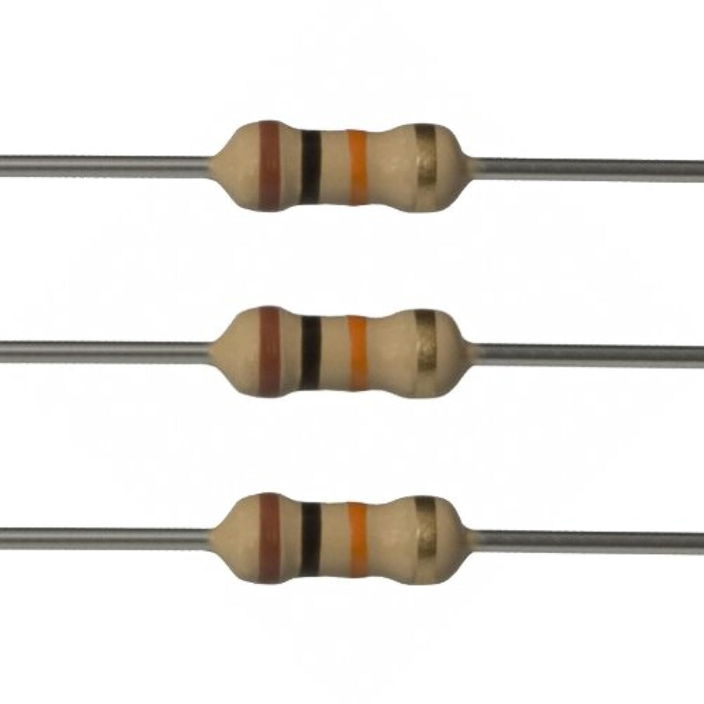

ຕົວຢ່າງ  ບໍ່ມີ Resistor:** ຖ້າຕໍ່ LED ໂດຍກົງກັບຂາ 5V ຂອງ Arduino, ຈະມີກະແສໄຟຟ້າໄຫຼຜ່ານ LED ຫຼາຍເກີນໄປ. LED ຈະ **ໄໝ້** ຫຼື **ເສຍຫາຍ** ທັນທີ.

11.Push Buttons (x4 with Lids )

ປຸ່ມກົດ (Push Button) ແມ່ນອົງປະກອບ Input ທີ່ງ່າຍດາຍທີ່ສຸດໃນວົງຈອນເອເລັກໂຕຣນິກ. ປຸ່ມກົດທີ່ທ່ານມີ (4 ໜ່ວຍພ້ອມຝາປິດ) ເຮັດໜ້າທີ່ເປັນ **Switch (ສະວິດ)** ແບບຊົ່ວຄາວ.
- ຮູບພາບອຸປະກອນຕົວຈິງ:
  
- 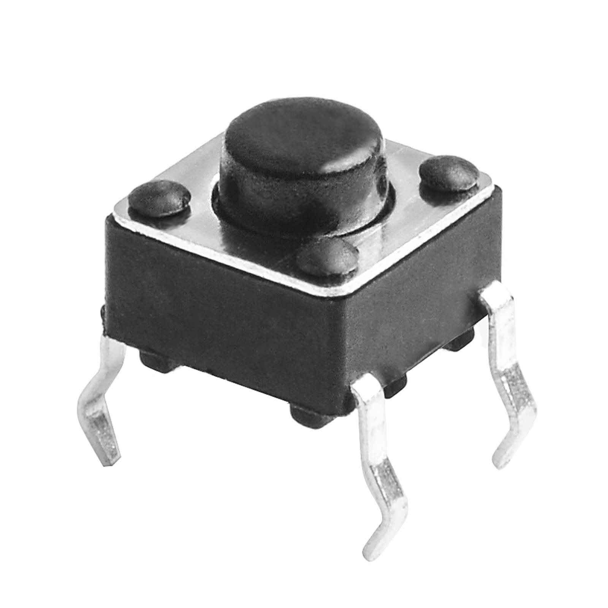

ຮູບອຸປະກອນແບບ Schematic Diagram :

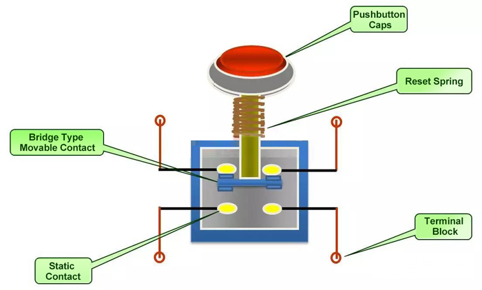

ຕົວຢ່າງນີ້ສະແດງໃຫ້ເຫັນວິທີການໃຊ້ **ປຸ່ມກົດ** ເປັນອຸປະກອນ Input ເພື່ອຄວບຄຸມ **ໄຟ LED** (Output)

12.Potentiometer (5kΩ)

**Potentiometer** (ຕົວຕ້ານທານທີ່ປັບຄ່າໄດ້) ແມ່ນຕົວຕ້ານທານສາມຂາທີ່ເຮັດໜ້າທີ່ເປັນ **ຕົວແບ່ງແຮງດັນໄຟຟ້າ (Voltage Divider)**. ປຸ່ມກົດທີ່ທ່ານມີຂະໜາດ **$5k\Omega$** (5000 ໂອມ) ໝາຍຄວາມວ່າຄ່າຄວາມຕ້ານທານສູງສຸດທີ່ມັນສາມາດໃຫ້ໄດ້ແມ່ນ $5,000\Omega$.
- ຮູບພາບອຸປະກອນຕົວຈິງ:
  
- 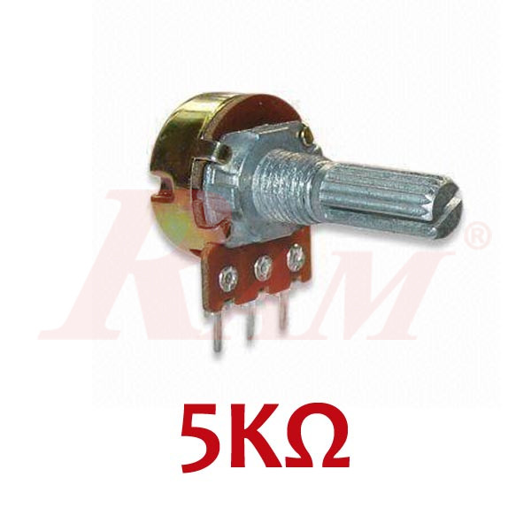

ຮູບອຸປະກອນແບບ Schematic Diagram :

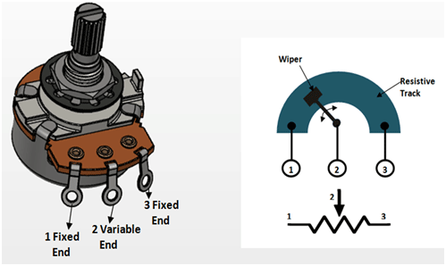

ຕົວຢ່າງ ສະແດງໃຫ້ເຫັນວິທີການໃຊ້ **Potentiometer** ເພື່ອປ້ອນຄ່າ **Analog Input** ໃຫ້ແກ່ Arduino, ແລ້ວນຳຄ່ານັ້ນໄປຄວບຄຸມຄ່າ **Digital Output**

13.Active Buzzer

**Active Buzzer** (ບາງຄັ້ງກໍເອີ້ນວ່າ Active Piezo Buzzer) ແມ່ນອຸປະກອນ Output ທີ່ງ່າຍດາຍເຊິ່ງໃຊ້ສຳລັບການ **ສ້າງສຽງ** ຫຼື **ສັນຍານສຽງ** ໃນວົງຈອນເອເລັກໂຕຣນິກ.
- ຮູບພາບອຸປະກອນຕົວຈິງ

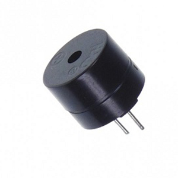

ຕົວຢ່າງນີ້ສະແດງໃຫ້ເຫັນວິທີການໃຊ້ **Active Buzzer** ຮ່ວມກັບ Arduino Uno ເພື່ອສ້າງສຽງແຈ້ງເຕືອນແບບງ່າຍໆ. ເນື່ອງຈາກ Active Buzzer ມີວົງຈອນສ້າງຄວາມຖີ່ພາຍໃນຕົວ

14 . Passive Buzzer

**Passive Buzzer** (ບາງຄັ້ງກໍເອີ້ນວ່າ Passive Piezo Buzzer) ແມ່ນອຸປະກອນ Output ທີ່ໃຊ້ສຳລັບການ **ສ້າງສຽງ** ຫຼື **ສັນຍານດົນຕີ** ໃນວົງຈອນເອເລັກໂຕຣນິກ. ມັນແຕກຕ່າງຈາກ Active Buzzer ຕົງທີ່ມັນ **ບໍ່ມີ** ວົງຈອນສ້າງຄວາມຖີ່ (Oscillator) ຢູ່ໃນຕົວ.
- ຮູບພາບອຸປະກອນຕົວຈິງ:

- 

ຕົວຢ່າງນີ້ສະແດງໃຫ້ເຫັນເຖິງການນຳໃຊ້ **Passive Buzzer** ຮ່ວມກັບ Arduino Uno ເພື່ອສ້າງສຽງດົນຕີໂດຍການກຳນົດຄວາມຖີ່ຂອງສຽງ (Tone) ທີ່ແຕກຕ່າງກັນ

#### 📟 Displays & Output

15 .16x2 LCD display

**16x2 LCD Display** (Liquid Crystal Display) ແມ່ນໜ້າຈໍສະແດງຜົນຂໍ້ຄວາມຂະໜາດນ້ອຍທີ່ຖືກນໍາໃຊ້ທົ່ວໄປໃນໂຄງການ Arduino. ຊື່ **16x2** ໝາຍຄວາມວ່າໜ້າຈໍນີ້ສາມາດສະແດງຂໍ້ຄວາມໄດ້ **16 ຕົວອັກສອນ** ຕໍ່ແຖວ ແລະມີທັງໝົດ **2 ແຖວ**.
- ຮູບພາບອຸປະກອນຕົວຈິງ:

ຮູບອຸປະກອນແບບ Schematic Diagram :

ຕົວຢ່າງນີ້ແມ່ນສະແດງວິທີການໃຊ້ Arduino ເພື່ອສົ່ງຂໍ້ຄວາມໄປສະແດງຢູ່ເທິງໜ້າຈໍ LCD 16x2. ເນື່ອງຈາກການເຊື່ອມຕໍ່ແບບ I2C (2 ສາຍ) ງ່າຍດາຍກວ່າ, ຕົວຢ່າງນີ້ຈະອີງໃສ່ການໃຊ້ **LCD Module ທີ່ມີ I2C Adapter**.

16 . I2C Serial Adapter board module

ແມ່ນແຜງວົງຈອນຂະໜາດນ້ອຍທີ່ຖືກອອກແບບມາເພື່ອ **ຫຼຸດຜ່ອນຈຳນວນສາຍໄຟ** ທີ່ຕ້ອງການໃນການເຊື່ອມຕໍ່ອຸປະກອນເຊັ່ນ: 16x2 LCD Display ກັບ Arduino.
- ຮູບພາບອຸປະກອນຕົວຈິງ:
  
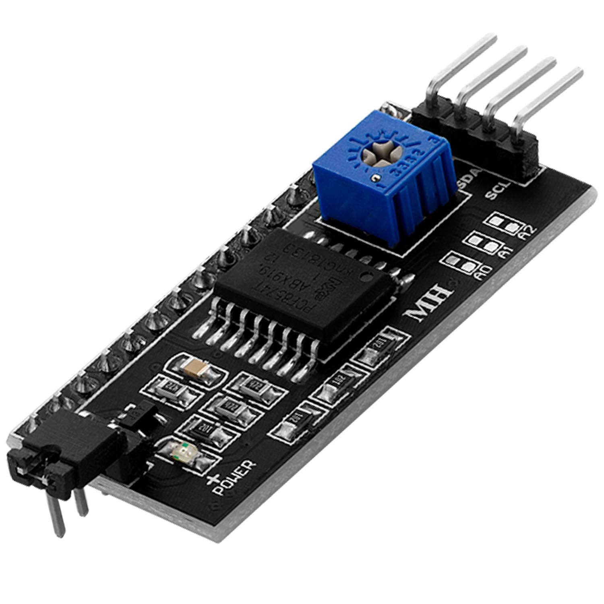

ຮູບອຸປະກອນແບບ Schematic Diagram :

ຕົວຢ່າງນີ້ສະແດງໃຫ້ເຫັນເຖິງການນຳໃຊ້ **I2C Serial Adapter Module** ເປັນຂົວເຊື່ອມຕໍ່ລະຫວ່າງ Arduino ແລະ ໜ້າຈໍ 16x2 LCD Display ດ້ວຍສາຍໄຟຟ້າພຽງສີ່ເສັ້ນ.
17 . 7-segment display (Common Cathode +)

**7-Segment Display** ແມ່ນອຸປະກອນ Output ທີ່ໃຊ້ສຳລັບການສະແດງຕົວເລກ (0-9) ແລະ ບາງຕົວອັກສອນງ່າຍໆ. ມັນປະກອບດ້ວຍ **ໄຟ LED 7 ໜ່ວຍ** ທີ່ຖືກຈັດລຽງເປັນຮູບແບບທີ່ຄ້າຍຄືເລກ 8 (ບວກກັບ LED ຈຸດທົດສະນິຍົມ).
- ຮູບພາບອຸປະກອນຕົວຈິງ:
  
- 
  
ຮູບອຸປະກອນແບບ Schematic Diagram :

ຕົວຢ່າງນີ້ສະແດງໃຫ້ເຫັນວິທີການໃຊ້ **7-Segment Display (Common Cathode)** ຮ່ວມກັບ Arduino ເພື່ອໃຫ້ມັນສະແດງຕົວເລກທີ່ກຳນົດໄວ້

18 . 4-Digit 7-Segment Display

**4-Digit 7-Segment Display** ແມ່ນໜ້າຈໍສະແດງຜົນທີ່ປະກອບດ້ວຍ **4 ຕົວເລກ** ລວມເຂົ້າກັນໃນໂມດູນດຽວ, ເຊິ່ງແຕ່ລະຕົວເລກແມ່ນປະກອບດ້ວຍ $7$ Segments (ບວກກັບ $DP$). ມັນຖືກໃຊ້ເພື່ອສະແດງຕົວເລກສູງສຸດເຖິງ $9999$ (ເຊັ່ນ: ໂມງ, ເຄື່ອງນັບ)
- ຮູບພາບອຸປະກອນຕົວຈິງ:
  
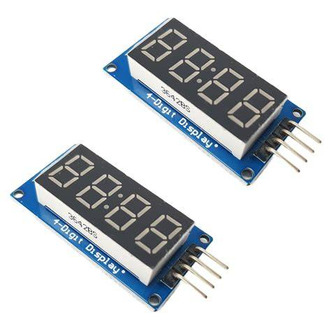

ຮູບອຸປະກອນແບບ Schematic Diagram :

ຕົວຢ່າງນີ້ສະແດງໃຫ້ເຫັນຫຼັກການຂອງການໃຊ້ **Multiplexing** ເພື່ອສະແດງຕົວເລກ 4 ຕົວ (ເຊັ່ນ: $1234$) ຢູ່ເທິງ 4-Digit 7-Segment Display.

19 . 8x8 Dot Matrix display

**8x8 Dot Matrix Display** ແມ່ນໜ້າຈໍສະແດງຜົນຂະໜາດນ້ອຍເຊິ່ງປະກອບດ້ວຍ **ໄຟ LED 64 ໜ່ວຍ** (8 ແຖວ $\times$ 8 ຖັນ) ທີ່ຖືກຈັດລຽງກັນເປັນຕາຂ່າຍ. ມັນຖືກນຳໃຊ້ເພື່ອສະແດງຕົວອັກສອນ, ຮູບພາບແບບພິກເຊວ, ແລະ ຮູບແບບການເຄື່ອນໄຫວ.
- ຮູບພາບອຸປະກອນຕົວຈິງ:
  
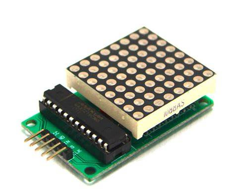

ຕົວຢ່າງ ເນື່ອງຈາກການຄວບຄຸມ 8x8 Dot Matrix ໂດຍກົງດ້ວຍ Arduino ແມ່ນສັບສົນຫຼາຍ, ຕົວຢ່າງນີ້ຈະໃຊ້ວິທີການທີ່ມັກໃຊ້ທີ່ສຸດຄືການນຳໃຊ້ **MAX7219 Chip Driver** ເຊິ່ງເຮັດໃຫ້ການເຊື່ອມຕໍ່ ແລະ ການຂຽນໂປຣແກຣມງ່າຍຂຶ້ນຢ່າງຫຼວງຫຼາຍ.

#### 📡 Sensors & Input Modules

20 . Temperature and humidity sensor (DHT11)

ແມ່ນເຊັນເຊີທີ່ໃຊ້ກັນຢ່າງກວ້າງຂວາງໃນໂຄງການ Arduino ເພື່ອວັດແທກ **ອຸນຫະພູມ (Temperature)** ແລະ **ຄວາມຊຸ່ມຊື່ນ (Humidity)** ຂອງອາກາດອ້ອມຂ້າງ.
- ຮູບພາບອຸປະກອນຕົວຈິງ:
  
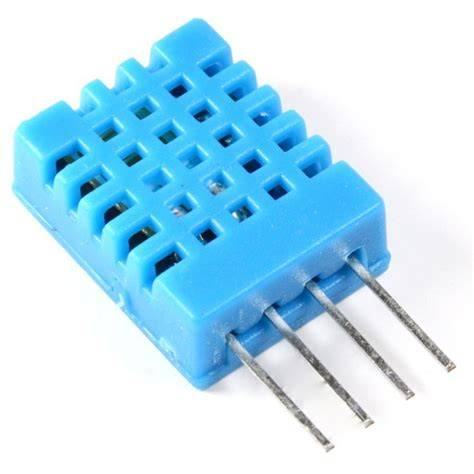

ຕົວຢ່າງນີ້ສະແດງໃຫ້ເຫັນວິທີການນຳໃຊ້ເຊັນເຊີ **DHT11** ຮ່ວມກັບ Arduino Uno ເພື່ອວັດແທກຄ່າອຸນຫະພູມ ແລະ ຄວາມຊຸ່ມຊື່ນ, ແລ້ວສະແດງຜົນອອກທາງ **Serial Monitor**.

21 . LM35 Temperature Sensor

**LM35** ແມ່ນເຊັນເຊີວັດອຸນຫະພູມແບບ **Analog** ທີ່ໃຫ້ຄ່າຜົນຜະລິດທີ່ເປັນແຮງດັນໄຟຟ້າ ($V$) ໂດຍກົງຕາມອຸນຫະພູມ (ໃນ $\text{Celsius}$). ມັນຖືກນຳໃຊ້ຢ່າງກວ້າງຂວາງໃນໂຄງການເອເລັກໂຕຣນິກຍ້ອນຄວາມຖືກຕ້ອງແລະຄວາມງ່າຍໃນການນຳໃຊ້.
- ຮູບພາບອຸປະກອນຕົວຈິງ:
  
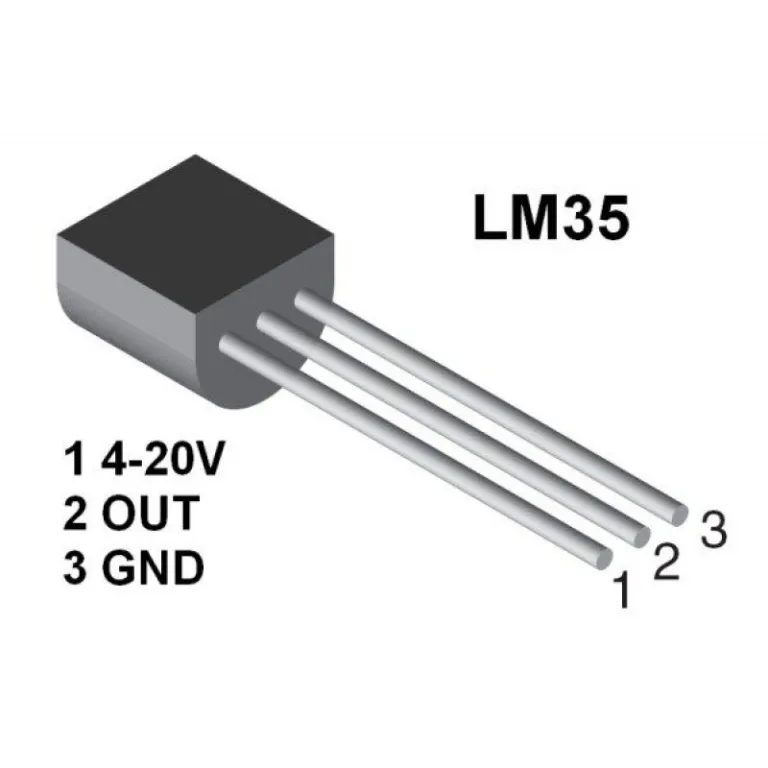

ຕົວຢ່າງນີ້ສະແດງໃຫ້ເຫັນວິທີການເຊື່ອມຕໍ່ **LM35** ກັບ Arduino Uno ເພື່ອອ່ານຄ່າແຮງດັນ Analog ແລະ ແປງຄ່ານັ້ນໃຫ້ເປັນອຸນຫະພູມ

22 .Tilt sensor (x2)

**Tilt Sensor (ເຊັນເຊີຄວາມອຽງ)** ແມ່ນອຸປະກອນທີ່ງ່າຍດາຍເຊິ່ງຖືກໃຊ້ເພື່ອກວດສອບ **ມຸມ** ຫຼື **ທິດທາງ** ຂອງວັດຖຸ. ມັນເຮັດໜ້າທີ່ຄືກັບ **Switch** (ສະວິດ) ທີ່ຄວບຄຸມດ້ວຍທ່າອຽງ.
- ຮູບພາບອຸປະກອນຕົວຈິງ:
  
.jpg)

 ຕົວຢ່າງ ໃຊ້ Tilt Sensor ເປັນ **Digital Input** ໂດຍມີ $10k\Omega$ Pull-Down Resistor. ເມື່ອເຊັນເຊີອຽງ, ມັນຈະສົ່ງສັນຍານ HIGH ເພື່ອເປີດໄຟ LED.
 
 23 .Photoresistor (LDRs x3) 
 
 ແມ່ນເຊັນເຊີທີ່ເຮັດໜ້າທີ່ເປັນ **ຕົວຕ້ານທານທີ່ປ່ຽນແປງຕາມແສງສະຫວ່າງ**. ມັນຖືກໃຊ້ເພື່ອກວດຈັບລະດັບຄວາມສະຫວ່າງໃນສະພາບແວດລ້ອມ.
 - ຮູບພາບອຸປະກອນຕົວຈິງ:
   
 .jpg)

 ຕົວຢ່າງ ໃຊ້ LDR ເປັນ **Analog Input** ໂດຍຜ່ານວົງຈອນ Voltage Divider. ລະດັບຄວາມສະຫວ່າງທີ່ປ່ຽນແປງຈະຖືກແປງເປັນຄ່າ $\text{PWM}$ ເພື່ອຄວບຄຸມ $\text{LED}$.
 
 24 . PIR sensor
 
 **PIR Sensor** (Passive Infrared Sensor) ແມ່ນເຊັນເຊີທີ່ໃຊ້ເພື່ອກວດຈັບ **ການເຄື່ອນໄຫວ** ຂອງສິ່ງທີ່ມີຊີວິດ (ຄົນ, ສັດ) ໂດຍການວັດແທກການປ່ຽນແປງຂອງ **ຄວາມຮ້ອນ (Infrared Radiation)** ໃນພື້ນທີ່ທີ່ກວດຈັບ.
 - ຮູບພາບອຸປະກອນຕົວຈິງ:
   

  
   ຕົວຢ່າງ  ໃຊ້ PIR Sensor ເປັນ **Digital Input** ເພື່ອກວດຈັບການປ່ຽນແປງຂອງຄວາມຮ້ອນ. ເມື່ອມີການເຄື່ອນໄຫວ, ມັນຈະສົ່ງສັນຍານ HIGH ໄປຫາ Arduino ເພື່ອເປີດໄຟ LED.
   
 25 . Ultrasonic module 
 
 ແມ່ນເຊັນເຊີທີ່ໃຊ້ເພື່ອກວດຈັບ **ໄລຍະທາງ** ໄປຫາວັດຖຸໂດຍການນຳໃຊ້ **ຄື້ນສຽງຄວາມຖີ່ສູງ (Ultrasonic Sound Waves)**. ມັນເປັນອຸປະກອນທີ່ສຳຄັນໃນການຫຼີກລ້ຽງສິ່ງກີດຂວາງ ແລະ ການວັດແທກໄລຍະທາງແບບບໍ່ສຳຜັດ.
 
 - ຮູບພາບອຸປະກອນຕົວຈິງ:
  
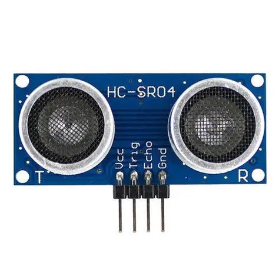
   
 - ຕົວຢ່າງ  ໃຊ້ Pin **Trig** ສົ່ງຄື້ນສຽງ, ໃຊ້ Pin **Echo** ວັດແທກໄລຍະເວລາທີ່ສຽງສະທ້ອນກັບຄືນມາ (Time of Flight), ແລະຄຳນວນໄລຍະທາງເປັນ $\text{cm}$.
  
  26 . Sound sensor
   
 - **Sound Sensor Module** (ເຊັນເຊີສຽງ), ເຊິ່ງມັກຈະມີໄມໂຄຣໂຟນຂະໜາດນ້ອຍຕິດຕັ້ງຢູ່, ແມ່ນອຸປະກອນທີ່ໃຊ້ເພື່ອກວດຈັບ **ຄວາມເຂັ້ມຂອງສຽງ (Intensity)** ຫຼື **ລະດັບສຽງ** ໃນສະພາບແວດລ້ອມອ້ອມຂ້າງ. ມັນບໍ່ສາມາດແຍກແຍະຄຳເວົ້າ ຫຼື ຄວາມຖີ່ຂອງສຽງໄດ້ຢ່າງຊັດເຈນ, ແຕ່ມັນສາມາດບອກໄດ້ວ່າສຽງດັງ ຫຼື ເບົາ
 - - ຮູບພາບອຸປະກອນຕົວຈິງ:
     
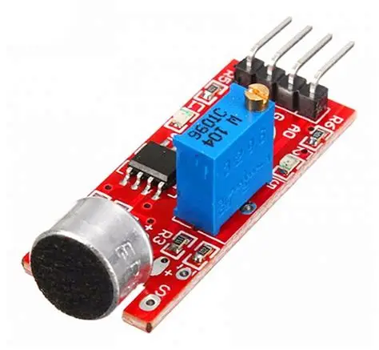
 
 ຕົວຢ່າງ  ໃຊ້ Sound Sensor ຜ່ານ $\text{Analog Output (A0)}$ ເພື່ອອ່ານຄວາມເຂັ້ມຂອງສຽງ. ຄ່າທີ່ໄດ້ມາຈະຖືກປ່ຽນ (Map) ເປັນຄ່າ $\text{PWM}$ ເພື່ອປັບຄວາມສະຫວ່າງຂອງ $\text{LED}$.
 
 27 . Water sensor 
 
 **Water Sensor Module** (ເຊັນເຊີກວດຈັບນ້ຳ) ແມ່ນເຊັນເຊີທີ່ໃຊ້ເພື່ອກວດຈັບ **ການມີຢູ່** ຂອງນ້ຳ, **ລະດັບນ້ຳ**, ຫຼື **ຝົນ** ໂດຍການວັດແທກການນຳໄຟຟ້າຂອງນ້ຳ. ມັນເປັນທີ່ນິຍົມໃຊ້ໃນລະບົບປ້ອງກັນນ້ຳຖ້ວມ ຫຼື ລະບົບການຫົດນ້ຳອັດຕະໂນມັດ.
 - ຮູບພາບອຸປະກອນຕົວຈິງ:
   

  ຕົວຢ່າງ ໃຊ້ Water Sensor ຜ່ານ $\text{Analog Output (A0)}$ ເພື່ອອ່ານຄວາມຕ້ານທານທີ່ປ່ຽນແປງເມື່ອມີນ້ຳສຳຜັດກັບເສັ້ນໄຟຟ້າ. ຄ່າ $\text{Analog}$ ຈະຖືກແປງເປັນເປີເຊັນຂອງຄວາມຊຸ່ມຊື້ນ.
  
  28 . Flame sensor
  
  **Flame Sensor Module** (ເຊັນເຊີແປວໄຟ) ແມ່ນອຸປະກອນທີ່ໃຊ້ເພື່ອກວດຈັບ **ແສງ Infrared (IR)** ຫຼື **ແສງ UV** ທີ່ຖືກປ່ອຍອອກມາຈາກແປວໄຟ. ມັນຖືກນຳໃຊ້ຢ່າງກວ້າງຂວາງໃນລະບົບປ້ອງກັນໄຟໄໝ້ ແລະ ລະບົບແຈ້ງເຕືອນໄພ.
  - ຮູບພາບອຸປະກອນຕົວຈິງ:
    
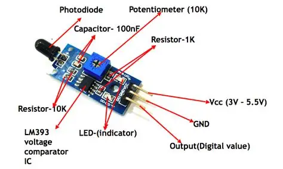
   
   ຕົວຢ່າງ ໃຊ້ Flame Sensor ຜ່ານ $\text{Digital Output (D0)}$ ເພື່ອກວດຈັບແສງ $\text{IR}$ ຈາກແປວໄຟ. ເມື່ອກວດພົບ, ມັນຈະສົ່ງສັນຍານເພື່ອເປີດ $\text{Passive Buzzer}$ ໃຫ້ດັງຂຶ້ນ.
   
   29 . RFID module
   
   RFID (Flame Ionization Detector)** ບໍ່ແມ່ນໂມດູນເຊັນເຊີທີ່ໃຊ້ທົ່ວໄປໃນໂຄງການ Arduino ຫຼື ເອເລັກໂຕຣນິກຂັ້ນພື້ນຖານ. ມັນເປັນອຸປະກອນທີ່ຊັບຊ້ອນ ແລະ ມີຄວາມລະອຽດສູງ ເຊິ່ງຖືກນຳໃຊ້ເປັນຕົ້ນຕໍໃນຂົງເຂດ **ການວິເຄາະທາງເຄມີ (Chemical Analysis)** ໂດຍສະເພາະແມ່ນໃນເຄື່ອງມືທີ່ເອີ້ນວ່າ **Gas Chromatography (GC)**
   - ຮູບພາບອຸປະກອນຕົວຈິງ:
     

     
   - ຕົວຢ່າງ ໃຊ້ແປວໄຟ Hydrogen ເພື່ອ **ແຕກຕົວເປັນໄອອອນ** ທາດປະກອບຄາບອນ ($\text{Organic Compounds}$) ທີ່ຖືກແຍກອອກມາຈາກເຄື່ອງ $\text{GC}$, ແລ້ວວັດແທກກະແສໄຟຟ້າທີ່ເກີດຂຶ້ນ.
     
   - 30 . RFID tag
    
     RFID Tag ແມ່ນອຸປະກອນຂະໜາດນ້ອຍທີ່ໃຊ້ໃນລະບົບ **RFID** ເພື່ອເກັບຂໍ້ມູນແລະສົ່ງຂໍ້ມູນນັ້ນແບບໄຮ້ສາຍໄປຫາ **RFID Reader**. ລະບົບນີ້ຖືກໃຊ້ຢ່າງກວ້າງຂວາງໃນການຕິດຕາມສິນຄ້າຄົງຄັງ, ການຄວບຄຸມການເຂົ້າອອກ, ແລະ ການລະບຸຕົວຕົນ.
     ຮູບພາບອຸປະກອນຕົວຈິງ:
       
     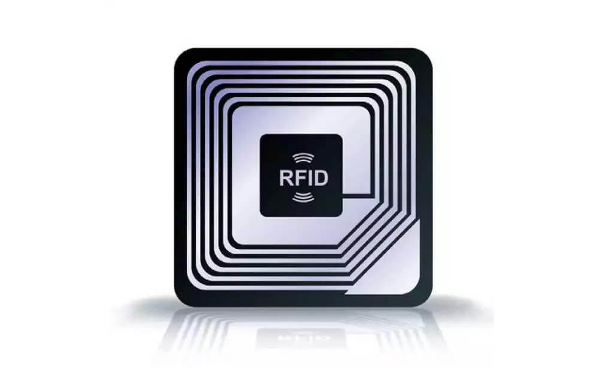
     
     ຕົວຢ່າງ ຕໍ່ໄປນີ້ຈະສະແດງວິທີການໃຊ້ **RFID Reader Module ($\text{RC522}$)** ເພື່ອອ່ານລະຫັດ $\text{UID}$ ຂອງ **RFID Tag (Passive)**.
     
     31 .  Infrared receiver
     
   - **Infrared Receiver Module** (ເຊັ່ນ: $\text{VS1838B}$ ຫຼື $\text{TSOP}$ ຊຸດ) ແມ່ນເຊັນເຊີທີ່ໃຊ້ເພື່ອກວດຈັບ **ແສງ Infrared (IR)** ທີ່ຖືກປ່ອຍອອກມາຈາກຣີໂມດຄວບຄຸມ ($\text{IR}$ Remote Control). ມັນເຮັດໜ້າທີ່ເປັນ "ຫູ" ຂອງ Arduino ເພື່ອຮັບຄຳສັ່ງແບບໄຮ້ສາຍ.
   -  ຮູບພາບອຸປະກອນຕົວຈິງ:
       
   - 
   - 
   - ຕົວຢ່າງ  ໃຊ້ $\text{IR Receiver}$ ເພື່ອຮັບລະຫັດ $\text{Hex}$ ຈາກຣີໂມດ. ຈາກນັ້ນ, ໂປຣແກຣມຈະກວດສອບລະຫັດເຫຼົ່ານັ້ນເພື່ອເປີດ ຫຼື ປິດ $\text{LED}$.
 
   -  🎮 Remote & Control
     
   - 32 . Infrared remote control
     
   - **IR Remote Control** ແມ່ນອຸປະກອນທີ່ໃຊ້ເພື່ອສົ່ງຄຳສັ່ງແບບໄຮ້ສາຍໄປຫາເຄື່ອງໃຊ້ໄຟຟ້າ (ເຊັ່ນ: ໂທລະພາບ,
   - ເຄື່ອງຫຼິ້ນ $\text{DVD}$, $\text{AC}$) ໂດຍການນຳໃຊ້ **ແສງ Infrared (IR)**.
   -  ຮູບພາບອຸປະກອນຕົວຈິງ:
       
   - 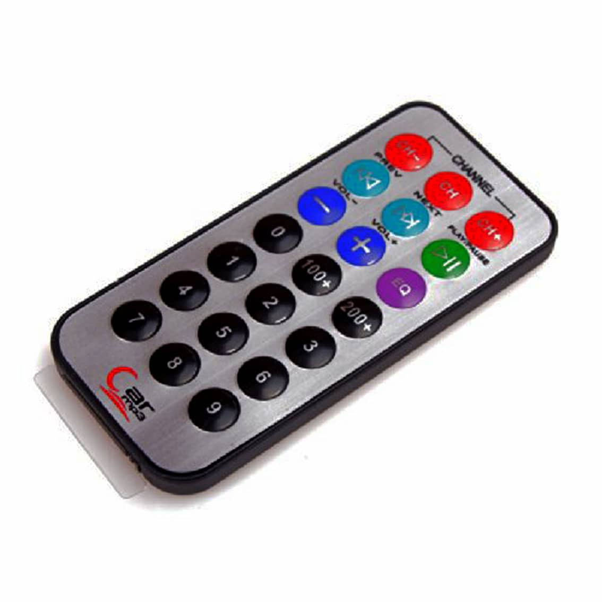
   -  
   - ຕົວຢ່າງ  ຣີໂມດສົ່ງລະຫັດ $\text{Hex}$ ທີ່ຖືກ $\text{modulated}$ ດ້ວຍຄວາມຖີ່ $38 \text{kHz}$. $\text{IR Receiver}$ ຮັບລະຫັດນັ້ນ ແລະ Arduino ຖອດລະຫັດເພື່ອໃຫ້ສາມາດຄວບຄຸມ $\text{LED}$ ໄດ້.
      
   - 33 . Joystick module
    
   - **Joystick Module** ແມ່ນເຊັນເຊີ Input ທີ່ອະນຸຍາດໃຫ້ຜູ້ໃຊ້ຄວບຄຸມການເຄື່ອນໄຫວໃນ **ສອງແກນ (X ແລະ Y)**, ພ້ອມທັງມີ **ປຸ່ມກົດ (Switch)**.
   -  ຮູບພາບອຸປະກອນຕົວຈິງ:
    
   - 

   - ຕົວຢ່າງ ໃຊ້ $\text{A0}$ ແລະ $\text{A1}$ ອ່ານຄ່າ $0-1023$ ສໍາລັບຕໍາແໜ່ງຕາມແກນ $\text{X}$ ແລະ $\text{Y}$, ແລະໃຊ້ $\text{Digital Pin}$ ອ່ານສະຖານະຂອງປຸ່ມກົດ.
     
   - 34 . 4x4 Matrix Keyboard Module
     
   - ແມ່ນແຜງປຸ່ມກົດທີ່ປະກອບດ້ວຍ **16 ປຸ່ມ** ທີ່ຖືກຈັດລຽງເປັນ **4 ແຖວ (Rows)** ແລະ **4 ຖັນ (Columns)**. ມັນເປັນວິທີທີ່ປະຢັດ $\text{Digital Pin}$ ຂອງ $\text{Arduino}$ ເພາະວ່າການຄວບຄຸມ 16 ປຸ່ມກົດແຍກກັນຈະຕ້ອງໃຊ້ 16 $\text{Pin}$, ແຕ່ດ້ວຍ       text{Matrix Keyboard}$, ທ່ານໃຊ້ພຽງແຕ່ **8 Pin** ເທົ່ານັ້ນ.
   - ຮູບພາບອຸປະກອນຕົວຈິງ:
       
   - 
     
   - ຕົວຢ່າງ  ໃຊ້ $\text{Library Keypad}$ ເພື່ອປະຕິບັດການ $\text{Matrix Scanning}$ ຜ່ານ 8 Pins. ປຸ່ມທີ່ຖືກກົດຈະຖືກລະບຸ ແລະ ສະແດງຜົນອອກມາ
     
   - 35 . Relay module
     
   - ແມ່ນອຸປະກອນທີ່ເຮັດໜ້າທີ່ຄືກັບ **ສະວິດໄຟຟ້າ (Electrically Operated Switch)**. ມັນອະນຸຍາດໃຫ້ວົງຈອນທີ່ມີແຮງດັນຕ່ຳ (ເຊັ່ນ: $5\text{V}$ ຈາກ Arduino) ສາມາດຄວບຄຸມການເປີດ/ປິດວົງຈອນທີ່ມີແຮງດັນສູງກວ່າ ຫຼື ຕ້ອງການກະແສໄຟຟ້າທີ່ສູງກວ່າ
   - ຮູບພາບອຸປະກອນຕົວຈິງ:
       
  
   
   ຕົວຢ່າງ  ໃຊ້ $\text{Digital Output}$ ຂອງ $\text{Arduino}$ ເພື່ອສົ່ງສັນຍານ $\text{LOW}$ ເພື່ອເປີດ $\text{Coil}$ ຂອງ Relay, ເຊິ່ງເຮັດໃຫ້ $\text{COM}$ ເຊື່ອມຕໍ່ກັບ $\text{NO}$ ເພື່ອເປີດ $\text{Load}$ ພາຍນອກ.
   
 ⚙️ Motors & Drivers
 
   36 . Servo motor
   
   **Servo Motor** ເປັນມໍເຕີ $\text{DC}$ ພິເສດທີ່ຖືກອອກແບບມາເພື່ອໃຫ້ສາມາດຄວບຄຸມ **ຕຳແໜ່ງມຸມ (Angular Position)** ໄດ້ຢ່າງຊັດເຈນ. ມັນບໍ່ໄດ້ຖືກໃຊ້ເພື່ອໝູນວຽນຢ່າງຕໍ່ເນື່ອງຄືກັບມໍເຕີ $\text{DC}$ ທົ່ວໄປ, ແຕ່ຖືກໃຊ້ເພື່ອຍ້າຍແຂນ (Horn) ຂອງມັນໄປຫາຕຳແໜ່ງທີ່ແນ່ນອນ
   - ຮູບພາບອຸປະກອນຕົວຈິງ:
     
  
  
  ຕົວຢ່າງ   ໃຊ້ $\text{Library Servo.h}$ ແລະຟັງຊັນ $\text{myServo.write(angle)}$ ເພື່ອສົ່ງ $\text{PWM Pulse}$ ທີ່ມີຄວາມກວ້າງທີ່ແນ່ນອນໄປຄວບຄຸມ $\text{Servo}$ ໃຫ້ໄປຫາຕຳແໜ່ງທີ່ຕ້ອງການ
  
  37 . Stepper motor
  
  ແມ່ນມໍເຕີ $\text{DC}$ ແບບ $\text{Brushless}$ ທີ່ແຕກຕ່າງຈາກມໍເຕີທົ່ວໄປ ເພາະມັນບໍ່ໄດ້ໝູນວຽນຢ່າງຕໍ່ເນື່ອງ. ແທນທີ່ຈະ, ມັນໝູນວຽນເປັນ **ຂັ້ນຕອນ (Steps)** ທີ່ມີມຸມທີ່ແນ່ນອນ (ເຊັ່ນ: $1.8^\circ$ ຫຼື $7.5^\circ$) ເມື່ອມັນໄດ້ຮັບ $\text{Pulse}$ ໄຟຟ້າຈາກໜ່ວຍຄວບຄຸມ. ນີ້ເຮັດໃຫ້ມັນສາມາດຄວບຄຸມ **ຕຳແໜ່ງ** ແລະ **ຄວາມໄວ** ໄດ້ຢ່າງຊັດເຈນຫຼາຍ.
  - ຮູບພາບອຸປະກອນຕົວຈິງ:
  - 
  -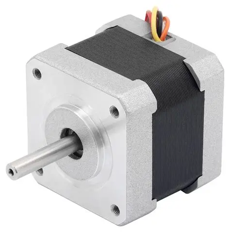
      
  - ຕົວຢ່າງ  ໃຊ້ $\text{Library Stepper.h}$ ເພື່ອສົ່ງ $\text{Pulse}$ ຕາມລໍາດັບທີ່ຖືກຕ້ອງໄປຫາ $\text{ULN2003 Driver}$. ມໍເຕີຈະໝູນວຽນຕາມຈໍານວນຂັ້ນຕອນທີ່ລະບຸ ($\text{2048}$ ຂັ້ນຕອນຕໍ່ຮອບ).
    
  - 38 . Stepper motor driver board
    
  - ແມ່ນວົງຈອນເອເລັກໂຕຣນິກທີ່ຈຳເປັນເພື່ອເປັນໂຕກາງລະຫວ່າງ $\text{Microcontroller}$ (ເຊັ່ນ: Arduino) ແລະ Stepper Motor. ໜ້າທີ່ຫຼັກຂອງມັນແມ່ນການ **ສະໜອງກະແສໄຟຟ້າທີ່ສູງຂຶ້ນ** ແລະ **ຄວບຄຸມລຳດັບການປ່ຽນທິດທາງກະແສໄຟຟ້າ** ທີ່ຈຳເປັນໃນການເຮັດໃຫ້ Motor ໝູນວຽນເປັນຂັ້ນຕອນ.
  - ຮູບພາບອຸປະກອນຕົວຈິງ:
    
  - 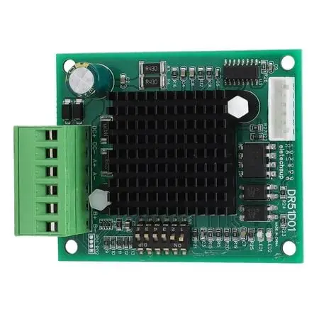
    
  - ຮູບອຸປະກອນແບບ Schematic Diagram :
    
  - 
     
  - ຕົວຢ່າງ   ໃຊ້ $\text{DIR}$ Pin ເພື່ອກຳນົດທິດທາງ ແລະ ສົ່ງ $\text{Pulse}$ ໄປຫາ $\text{STEP}$ Pin ເພື່ອໃຫ້ $\text{Motor}$ ໝູນວຽນໄປເທື່ອລະຂັ້ນຕອນ
    
   ICs & Modules
  - 39 . Real-time Clock Module DS1302
    
  - ແມ່ນ $\text{IC}$ ທີ່ອອກແບບມາເພື່ອຮັກສາການນັບເວລາຢ່າງຕໍ່ເນື່ອງ (ເຊັ່ນ: ວິນາທີ, ນາທີ, ຊົ່ວໂມງ, ມື້, ວັນທີ, ເດືອນ, ແລະ ປີ), ເຖິງແມ່ນວ່າໄຟຫຼັກຈະຖືກຕັດອອກກໍຕາມ. ມັນຖືກນຳໃຊ້ຢ່າງກວ້າງຂວາງໃນໂຄງການທີ່ຕ້ອງການຄວາມຖືກຕ້ອງຂອງເວລາ.
  -  ຮູບພາບອຸປະກອນຕົວຈິງ:
      
  - 
    
  - ຕົວຢ່າງ  ໃຊ້ $\text{3-Wire Serial Interface}$ ເພື່ອສື່ສານກັບ $\text{IC}$ ໂມງ, ອ່ານຄ່າວັນທີ ແລະ ເວລາທີ່ຖືກຮັກສາໄວ້ດ້ວຍແບັດເຕີຣີສຳຮອງ, ແລະສະແດງຜົນ $\text{DD/MM/YYYY HH:MM:SS}$ ອອກມາ.
    
  - 40 .  74HC595 Chip
    
   ແມ່ນ $\text{IC}$ ປະເພດ **8-bit Serial-In Parallel-Out Shift Register**. ມັນເປັນອົງປະກອບທີ່ມີປະໂຫຍດຫຼາຍໃນການຂະຫຍາຍຈຳນວນ $\text{Digital Output Pins}$ ຂອງ $\text{Microcontroller}$ ເຊັ່ນ $\text{Arduino}$. ມັນຊ່ວຍໃຫ້ທ່ານສາມາດຄວບຄຸມ $\text{8 Output Pins}$ (ເຊັ່ນ: $\text{8 LEDs}$) ໂດຍໃຊ້ພຽງແຕ່ **3 Digital Pins** ຂອງ $\text{Arduino}$ ເທົ່ານັ້ນ.
   - ຮູບພາບອຸປະກອນຕົວຈິງ:
     
     
      
     ຕົວຢ່າງໃຊ້ $\text{3 Pins}$ ($\text{Data}, \text{Clock}, \text{Latch}$) ເພື່ອສົ່ງ $\text{8 bits}$ ຂອງຂໍ້ມູນ ($\text{Byte}$) ໄປໃສ່ $\text{74HC595}$. ຫຼັງຈາກນັ້ນ, $\text{IC}$ ຈະໃຊ້ $\text{8 Output Pins}$ ຂອງມັນເພື່ອຄວບຄຸມ $\text{8 LEDs}$ ຕາມຂໍ້ມູນທີ່ໄດ້ຮັບ.
